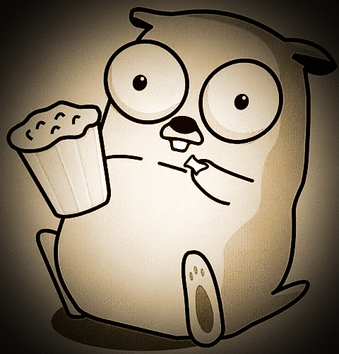

### FROMGOTOK8s

 

This project implements a proof of concept of a complete CI/CD for a golang project making use of the following tools:

 - travis to build/release/deploy
 - unit Testing
 - coverage tested with Coveralls
 - integration tests with dockerCompose
 - GCP to host a k8s cluster
 - Helm to deploy different releases
 - DockerHub to host built images
 - Github Pages to host static helm chartmuseum
 - viper to deal with configs
 - snyk to check vulnerabilities
 

The whole process is described in a series of medium articles: https://medium.com/@paolo.gallina/fromgotok8s-a-complete-ci-di-example-2ee49dd39f20.

 
