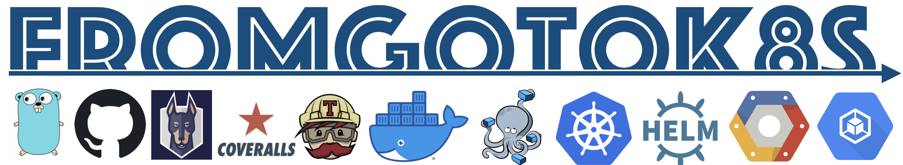

This GitHub page is used mostly to be used as a static public Chartmuseum and it is part of a full example of Ci/CD described in the following medium article:

 - https://medium.com/@paolo.gallina/fromgotok8s-a-complete-ci-di-example-2ee49dd39f20

To build the helm package to add it to the static chartmuseum
```sh
helm package fromgotok8s
```

To generate the needed index.yaml page  
```sh
helm repo index .
```

To review the index generated once the branch has been pushed go to 
 
 - https://gallo-cedrone.github.io/fromgotok8s/index.yaml

To make use of the static public Chartmuseum
```sh
helm repo add static-gallo-cedrone-repo https://gallo-cedrone.github.io/fromgotok8s
helm repo update
```


